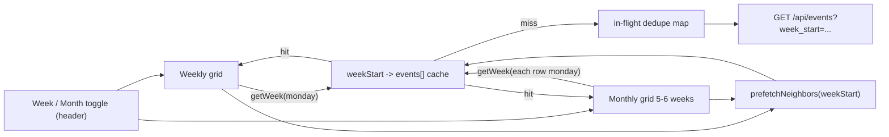

# Monthly view + shared per-week cache

## Goal

Solve two things at once with one shared piece of state:

1. Eliminate the "events don't update for several seconds" lag on weekly navigation (the original complaint) by caching weeks client-side and pre-fetching neighbors.
2. Add a monthly grid view on the same page, driven by the same cache, so switching views is free and within-month nav is mostly instant.

## Architecture

Single source of truth: a JS `Map<string, Event[]>` keyed by ISO Monday date. Both views read from it. The existing `fetchWeekEvents()` becomes a thin wrapper around `getWeek(currentMonday)`.

## Components

### 1. Per-week event cache + prefetch  ([static/js/calendar.js](static/js/calendar.js))

- New module-scope cache:
  - `weekCache: Map<string, Event[]>`
  - `inFlight: Map<string, Promise<Event[]>>` (dedupe concurrent requests for the same week)
- `getWeek(weekStart): Promise<Event[]>` returns cached, in-flight promise, or fires a new fetch and stores it.
- `prefetchNeighbors(weekStart)` fires `getWeek(prev)` and `getWeek(next)` without awaiting; never blocks UI.
- Replace the existing `fetchWeekEvents()` so all nav (`jumpWeek`, `shiftMobileDay` boundary, `goToday`) flows through `getWeek` + `prefetchNeighbors`.
- The race-token + immediate-clear behavior I just added stays, but now the cache hit path renders synchronously with no flash.

### 2. View toggle in the header  ([templates/calendar.html](templates/calendar.html), [static/css/calendar.css](static/css/calendar.css))

- Segmented control `Week | Month` placed in the existing header bar next to the date range label (and mirrored into the mobile context strip).
- State held in JS (`currentView`) and persisted in `localStorage` under `calendarView`.
- When `currentView === 'month'`:
  - Hide `#days` / weekly grid; show `#month-grid`.
  - Date range label and prev/next/today buttons retarget to month boundaries (prev month, next month, current month).
- When `currentView === 'week'`: existing behavior.

### 3. Monthly grid  ([templates/calendar.html](templates/calendar.html), [static/css/calendar.css](static/css/calendar.css), [static/js/calendar.js](static/js/calendar.js))

- New `
` sibling of `.week`, hidden until toggled.
- Render 6 rows x 7 cols (always 6 to avoid layout jumps).
- Each cell:
  - Day number (top-left), dimmed if out of current month.
  - Today highlighted with the same thin top border as the weekly day column.
  - Stacked horizontal bars below the day number: one per visible person (filter respected), length proportional to fraction of their visible-day window (`workStartHour`..`workEndHour`) they're busy. Cap at first 6 visible people; show "+N" pill if more.
  - Bar color = the person's `USER_COLORS` color from the weekly people list.
- Builds from cache: month view collects the unique Mondays for the 6 rows, calls `getWeek` for each in parallel, then renders per-day bars by indexing into the returned events.

### 4. Click-to-jump  ([static/js/calendar.js](static/js/calendar.js))

- Click a day cell -> set `currentView = 'week'`, set `currentMonday` to that day's Monday, render weekly view. On mobile additionally set `mobileDayOffset` so the clicked day is centered.

### 5. Loading state

- Re-use the `.is-loading` class added in the previous fix. Apply to whichever container is active (`.week` or `#month-grid`) while any week it needs is still mid-fetch.

## Mobile behavior

- The Week/Month toggle is visible on mobile in the mobile context strip.
- Monthly grid on narrow screens: same 7-col grid, but per-cell content collapses to just the day number + a single combined busy bar (no per-person bars) to stay readable. The drill-down click still jumps to weekly view (which is already the optimized 3-day rolling view).

## Files touched

- [static/js/calendar.js](static/js/calendar.js): add cache + prefetch + monthly render + view toggle wiring.
- [templates/calendar.html](templates/calendar.html): add toggle, monthly grid container, retarget header nav labels.
- [static/css/calendar.css](static/css/calendar.css): toggle styles, monthly grid + cell styles + stacked bars, mobile collapse.

## Non-goals (deliberate)

- No URL state for view (per your earlier choice). View persists via `localStorage`.
- Backend unchanged: monthly view does parallel `/api/events?week_start=...` calls via the same endpoint. Server-side caching stays the `LATER` item from `AGENTS.md`.
- No per-day popover, no recurring-event coloring tweaks, no group-vs-individual filter changes inside monthly view (filters carry over from weekly).

