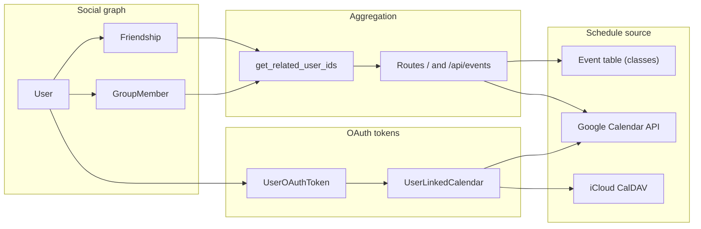
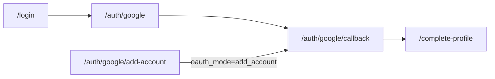

# AGENTS.md — group-schedule

**Read this file before making changes** to this repository. It records product direction, owner decisions, and how the Flask app is structured today so work stays aligned and scoped.

---

## Product intent

This app helps **you, friends, and a small business** see **one combined weekly view** of availability so you can plan together.

### Target direction (not necessarily implemented yet)

| Area | Direction |
|------|-----------|
| **Authentication** | **Google sign-in only** (OAuth); local username/password removed. |
| **Calendar data** | **Google Calendar API** as the primary source of truth, with **iCloud (CalDAV)** and **Outlook (Microsoft Graph)** as planned additional providers. Each provider connection is an OAuth token stored in `UserOAuthToken`; a user may link multiple accounts from the same or different providers. |
| **Privacy / detail** | **Configurable** how much others see (e.g. free/busy only vs event titles). Treat as an **open design**: OAuth scopes and API choice depend on the final model (`calendar.readonly`, `calendar.events.readonly`, or FreeBusy-style queries). |
| **ASU catalog integration** | **Keep the code** in the repo (e.g. `extras/api.py`) for reference or internal tooling, but **do not expose** it in the normal user experience (navigation, public routes, "add class" flows). |

### Owner decisions (fixed for planning)

- **Data migration**: Existing database contents **may be discarded**; no obligation to migrate current users or `Event` rows when moving to Google.
- **Auth end state**: **Google-only** (not a long-term dual local + Google product requirement).

---

## Planned features backlog

| Feature | Status | Notes |
|---------|--------|-------|
| **Multiple calendar accounts** (`/calendar-settings`) | **DONE** | A user can connect multiple Google accounts. Each connection stores a `UserOAuthToken` row. `UserLinkedCalendar` rows are scoped to the owning token. |
| **iCloud calendar integration** | **DONE** | Connect via CalDAV at `https://caldav.icloud.com/` using an app-specific password (`UserOAuthToken` with `provider='apple'`, credential stored in `refresh_token`). Uses the `caldav` Python library; read-only. Implemented in [`extras/icloud_calendar.py`](extras/icloud_calendar.py). |
| **Outlook / Microsoft Graph integration** | LATER | Microsoft OAuth + Graph API for `/me/calendars` and `/me/calendarview`. Slot in as a third `provider='microsoft'` analog to the Google flow. |
| **Performance / caching** | LATER | Requests are slow — likely a combination of unverified-app Google throttling and per-request live API calls. Investigate: (a) whether the unverified-app quota is the bottleneck, (b) adding a short-lived in-memory or DB cache keyed on `(user_id, week_start)` with a ~5-min TTL. |
| **Mobile weekly view** | LATER | The weekly grid does not scale on narrow screens. Fix with CSS media queries — collapse to a 3-day or single-day scroll view on small viewports. |
| **Weekly view defaults** | LATER | Default to full 7 days on desktop; reduce column gap; replace the current today-highlight with a subtler indicator (e.g. thin colored top border on the column header). |
| **Monthly view** | LATER | A grid calendar where each day cell shows stacked color bars representing tracked people's busy time. Open design questions: (a) how many people before cells get crowded? (b) free/busy color bars vs. event-count dots? (c) click-to-expand to day detail? (d) interaction with group vs. individual filtering? Resolve these with the owner before building. |
| **Add calendar items + SMS invite** | LATER | Allow a user to create an event (title, date/time, invitees from friends/groups) and send an email-to-SMS gateway message asking each invitee to add it. Open questions: which SMS gateway(s)? opt-in / phone number collection flow? does the event write back to Google Calendar or stay app-local? |

---

## Stack and runtime

- **Python**, **Flask 2.2**, **Flask-SQLAlchemy**, **Flask-Login**, **Authlib**, **python-dotenv**, **requests**, **gunicorn**, **caldav** (>=1.3, for iCloud) — see `requirements.txt`. `urllib3` is pinned to `>=2.0,<3.0`: `caldav` 3.x installs `urllib3-future` which can shadow the stock `urllib3` and break `requests`; if a fresh install of `caldav` does break `import requests`, force-reinstall `urllib3` (`pip install --force-reinstall --no-deps "urllib3>=2.0,<3.0"`).
- **Entry point**: `app.py` defines `app` directly (no application factory package). Same file registers the **Google OAuth** client (Authlib) when `GOOGLE_CLIENT_ID` and `GOOGLE_CLIENT_SECRET` are both set.
- **Database**: `SQLALCHEMY_DATABASE_URI` comes from `DATABASE_URL` when it is non-empty after trim; otherwise **`sqlite:///dev.db`** (empty `DATABASE_URL=` in `.env` must not break startup).
- **Secrets / OAuth env**: `SECRET_KEY`, `GOOGLE_CLIENT_ID`, `GOOGLE_CLIENT_SECRET` via environment / `.env`. Optional: `GOOGLE_OAUTH_REDIRECT_URI` (must match an authorized redirect URI in Google Cloud Console); `FLASK_SESSION_COOKIE_SECURE=true` in production behind HTTPS. Never commit real secrets — see **`.env.example`** (tracked; `.env` is gitignored).

### Repo hygiene warning

`notes.md` calls out that **instance paths / DB may not be gitignored** in some setups. Before committing, confirm you are not adding `*.db`, `.env`, or uploaded profile images unintentionally.

---

## Repository map

| Concern | Location |
|---------|----------|
| Routes, calendar assembly, **Google OAuth**, onboarding gate, social | `app.py` |
| SQLAlchemy models | `models.py` |
| `db`, `login_manager` | `extras/extensions.py` |
| ASU catalog HTTP helper | `extras/api.py` |
| Google Calendar HTTP (list, events, calendar metadata) | `extras/google_calendar.py` |
| iCloud Calendar CalDAV (list, events, principal discovery) | `extras/icloud_calendar.py` |
| Env var template (no secrets) | `.env.example` |
| Layout + nav | `templates/base.html` |
| Weekly calendar page | `templates/calendar.html` |
| Per-user calendar accounts (sync, visibility, multi-account) | `templates/calendar_settings.html` (`/calendar-settings`) |
| Auth UI | `templates/login.html` (Google sign-in only), `templates/onboarding.html` (`/complete-profile` — choose @handle, names) |
| Profile | `templates/me.html` |
| Friends / groups | `templates/friends.html`, `templates/groups.html`, `templates/group_detail.html` |
| Legacy class UI | `templates/classes.html` |
| ASU debug HTML | `templates/api.html` |
| Calendar JS / CSS | `static/js/calendar.js`, `static/css/calendar.css`, `static/css/shared.css` |

**Removed / redirected (auth migration):** there is no `templates/register.html`. Route **`/register`** exists only as a **redirect to `/login`**.

**Add-account OAuth:** `GET /auth/google/add-account` starts a separate consent flow (logged-in users only, `prompt=select_account consent`) that stores credentials into a new `UserOAuthToken` row without touching the user's primary login identity. Uses the same callback URL (`/auth/google/callback`) so no additional redirect URI needs to be registered in Google Cloud Console.

---

## Current architecture (facts)

### Authentication (today)

- **Google OAuth** (OpenID Connect) in **`app.py`** with **Authlib**: `GET /auth/google` (PKCE + nonce) → `GET /auth/google/callback` (token exchange, then `login_user`). Scopes: **`openid email profile`** plus **`https://www.googleapis.com/auth/calendar.readonly`** (Calendar API). Offline **`refresh_token`** is stored on **`users.google_refresh_token`** (legacy) and a matching `UserOAuthToken` row with `is_login_account=True`. `login_manager.user_loader` loads `User` by integer id; `login_view = 'login'` and a custom **`unauthorized_handler`** redirect unauthenticated users to `/login`.
- **`User`** (`models.py`): stable **`google_sub`**, **`email`**, optional **`username`** (public **@handle** for discovery; `NULL` until onboarding finishes), **`first_name` / `last_name`**, **`profile_image`**, optional **`google_refresh_token`** (legacy fallback — canonical token is now in `UserOAuthToken`). No **`password_hash`** or local password verification.
- **`UserOAuthToken`** (`models.py`): stores per-provider credentials, one row per connected account per user. Fields: `user_id` (FK), `provider` (`'google'` | `'apple'` | `'microsoft'`), `provider_account_id` (Google `sub`, Apple ID email, or Microsoft `oid`), `email`, `refresh_token`, `is_login_account` (bool — marks the account used for app sign-in). Unique constraint on `(user_id, provider, provider_account_id)`. `User` has a `oauth_tokens` relationship to this table. `UserLinkedCalendar` rows carry an `oauth_token_id` FK pointing here (nullable for legacy rows; NULL falls back to `user.google_refresh_token`). **Despite the column name**, `refresh_token` holds whatever long-lived credential the provider uses: an OAuth refresh token for Google/Microsoft, or a CalDAV app-specific password for Apple.
- **Google add-account flow**: `GET /auth/google/add-account` (requires `@login_required`) sets `session['oauth_mode'] = 'add_account'`, then redirects to Google OAuth with `prompt='select_account consent'`. The callback upserts a `UserOAuthToken` row (keyed on `provider_account_id`) without altering `users.google_sub` or `users.email`. The `_ONBOARDING_ALLOWED_ENDPOINTS` set includes `add_google_account` so partially-onboarded users can still reach it. Triggered from `templates/calendar_settings.html` by the "+ Add another Google account" link.
- **iCloud add-account flow**: Apple does **not** offer OAuth for calendar API access. To connect, the user generates an app-specific password at appleid.apple.com (requires 2FA), then submits Apple ID + that password to the `add_apple_account` POST action on `/calendar-settings`. The server validates with `icloud.validate_credentials` (a CalDAV `principal()` call), stores the credential in `UserOAuthToken`, and immediately calls `sync_apple_calendar_list_rows` so calendars appear without a second click. The form is hidden behind a collapsible `
` "+ Connect iCloud account" disclosure in the template (mirrors the Google button visually; no JS needed). Read-only access via the `caldav` library.
- **Account disconnect**: the `disconnect_account` POST action on `/calendar-settings` is provider-agnostic (matches any `UserOAuthToken` by `id`+`user_id`) and refuses to delete a token with `is_login_account=True`. Cascade deletes the `UserLinkedCalendar` rows tied to that token.
- **Onboarding gate**: `@app.before_request` function **`_redirect_incomplete_profile`** sends logged-in users with **`username is None`** to **`/complete-profile`** only (plus allowed endpoints: Google auth, add-account, logout, static). Until they submit onboarding, other routes (calendar, friends, API, etc.) are unreachable.
- **`GET /login`**: "Continue with Google" (or a notice if OAuth env is missing). **`GET /register`**: **302 to `login`**. **`/logout`**: `logout_user` (allowed during incomplete onboarding).

### Social discovery (handles)

- **Friends** (`POST /friends`): resolve the target by **`handle`** form field (or legacy field name **`username`** for the same value) **or** by hidden **`friend_user_id`** (used from **`templates/group_detail.html`** "Add friend" to avoid typing handles).
- **Group invites** (`POST /groups/invite/<id>`): form field **`handle`** (backwards-compatible with **`username`** in `app.py`). Display and flash copy refer to **@handle**; the DB column remains **`users.username`**.

### Social graph

- **`Friendship`**: `requester_id`, `receiver_id`, `status` (`pending` | `accepted`), unique pair constraint.
- **`Group` / `GroupMember`**: creator, `role` (`admin` | `member`), `status` (`pending` | `accepted`), `display_order` for ordering in UI.

### Who appears on the calendar

`get_related_user_ids(user_id)` in `app.py` returns:

1. The user themselves  
2. All users with an **accepted** friendship (either direction)  
3. All users who are **accepted members** of any **group** the user is an **accepted** member of  

Same logic feeds the home calendar and `/api/events`.

### Schedule data (today)

1. **Google Calendar** (per user): **`UserLinkedCalendar`** rows (`provider='google'`, Google **`external_id`**, **`included_in_main_view`**, **`oauth_token_id`**) from **`calendarList`** via **Sync** on **`/calendar-settings`**, or added manually by calendar ID (validated with **`calendars.get`**). **`/`** and **`GET /api/events`** merge **Google `events.list`** (enabled calendars only; on-request fetch resolving the refresh token from `cal.oauth_token.refresh_token` with a fallback to `user.google_refresh_token`) with legacy DB **`Event`** rows below.
2. **iCloud Calendar** (per user): **`UserLinkedCalendar`** rows with `provider='apple'` and `external_id` set to the CalDAV calendar URL. Discovered via `principal.calendars()` and fetched per week via `Calendar.search(start, end, event=True, expand=True)` — recurring events are expanded into individual occurrences. Helpers live in [`extras/icloud_calendar.py`](extras/icloud_calendar.py).
3. **`Course`** → **`CourseSection`** (ASU-shaped fields: section id, term, days, times, date range).  
4. **`UserCourse`** links a user to a section.  
5. **`UserCourse.create_events(session)`** in `models.py` expands recurring meetings into many **`Event`** rows (and deletes prior generated rows for that enrollment).  

There is **no** generic "custom event" path outside Google + this class-derived pipeline today.

### ASU touchpoints (legacy / non-user-facing goal)

- **`/classes`**: POST adds enrollment; may call `fetch_class_by_section` / `parse_class_item` from `extras/api.py`.
- **`/api`**: GET debug page; calls `fetch_class_by_section` when `?section=` is present — **not** protected by `@login_required`.
- Templates: `templates/classes.html`, `templates/api.html`; nav link **Classes** in `templates/base.html`.

### Front-end contract (do not break silently)

- `templates/calendar.html` seeds `window.CFG` with `people` and `events` for the initial week.
- Week navigation uses **`GET /api/events?week_start=YYYY-MM-DD`** (JSON).

Each event in `events` / API response should match what `app.py` currently emits:

- **`day`**: integer weekday, **0 = Monday … 6 = Sunday** (Python `date.weekday()`).
- **`start`**, **`end`**: strings `"HH:MM"` (24h from `strftime`).
- **`person`**: integer `user_id`.
- **`title`**: string.

`static/js/calendar.js` builds busy gradients from this shape. If the backend changes shape or semantics, update the JS and this document together.

### User colors

`USER_COLORS` in `app.py` plus `get_user_color(user_id)` — calendar people list uses consistent colors per id.

---

## Directional diagram

**Auth routes (fact):** unauthenticated users hit **`/login`** → **`/auth/google`** → Google → **`/auth/google/callback`** → session; if **`users.username`** is still null, **`_redirect_incomplete_profile`** keeps them on **`/complete-profile`** until onboarding succeeds.

---

## Before you change code (checklist)

1. **Read this file** and the sections of `app.py` / `models.py` you will touch.  
2. **Respect the pivot**: Google auth + Google Calendar as the intended source of truth; do not invest in expanding ASU or DB-generated `Event` as long-term product paths without explicit owner direction.  
3. **ASU**: Do not add user-facing entry points (nav, marketing flows) for ASU unless the owner asks.  
4. **`/api/events` and `CFG.events`**: Preserve the contract above, or **version** the API and update `calendar.js` + this file.  
5. **Models**: Removing or altering `Event` / `UserCourse` / course tables impacts cascades and `create_events`; plan migrations or resets with the owner (data is disposable but schema must stay consistent).  
6. **`UserOAuthToken`**: When adding support for new providers (Apple, Microsoft), add new OAuth clients and helper modules (analogous to `extras/google_calendar.py`). The `provider` column is the discriminator; keep provider-specific logic in provider-specific helpers.  
7. **Scope**: Make minimal, task-focused diffs; avoid unrelated refactors and unsolicited new markdown files.  
8. **Google OAuth**: Authorized redirect URI(s) in Google Cloud Console must match the app's callback URL (`…/auth/google/callback`, or the full value of `GOOGLE_OAUTH_REDIRECT_URI` if you use that override). The add-account flow reuses the same callback URL intentionally.

---

## Related notes

Informal backlog and reminders live in `notes.md` (feature ideas, tech debt). That file is not a substitute for this contract.
